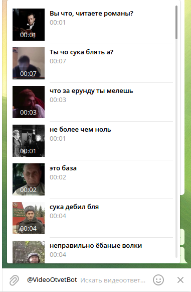
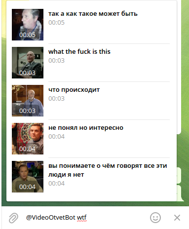

# Video Reply Telegram Bot

Telegram [inline bot](https://core.telegram.org/bots/inline) to allow reply with video-meme.
Like [t.me/gif](https://t.me/gif) but for videos.

[t.me/VideoOtvetBot](https://t.me/VideoOtvetBot)

Btw, you can upload your own video replies! **Please make sure you [read the rules](video-upload-policy.md) first!**

To upload the missing video reply just drop a video into the bot [t.me/VideoOtvetBot](https://t.me/VideoOtvetBot) and follow the instructions.
